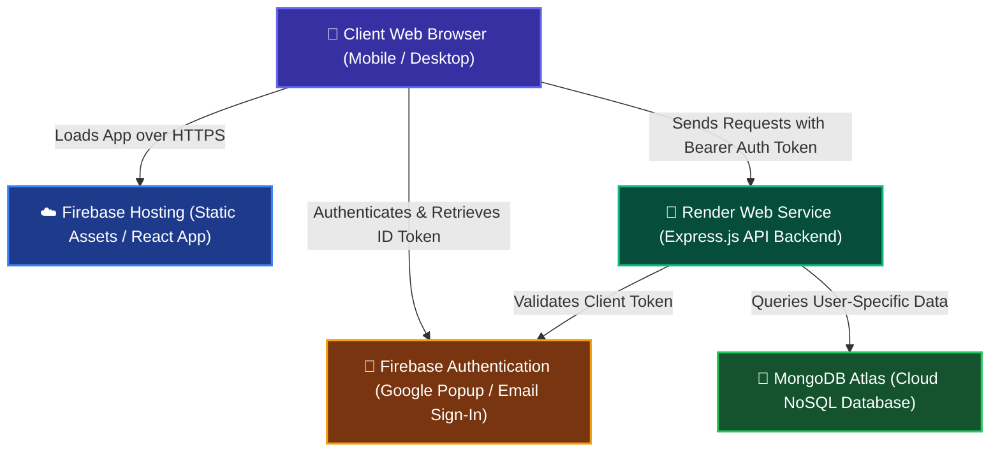

# ✈️ TaskPilot — Premium SaaS Task Management Portal

TaskPilot is a premium, full-stack SaaS task management portal built with the **MERN** stack (MongoDB, Express.js, React, Node.js), **Tailwind CSS v4**, **Framer Motion**, and **Firebase Authentication**. It features a state-of-the-art dark-mode glassmorphic user interface, real-time analytics dashboards, and secure token-based user data isolation.

### 🔗 Live Production Web App
👉 **[www.mini-project-management-4772.web.app](https://mini-project-management-4772.web.app)** 

---

## 🎨 Tech Stack & Tools


---

## 🏗️ System Architecture

TaskPilot is partitioned into a secure frontend client hosted on **Firebase Hosting** and an isolated API backend running on **Render Web Services**. Database persistence is managed via **MongoDB Atlas**, and authentication session state is handled securely by **Firebase Authentication**.



---

## 🌟 Key Features

*   **🔒 Secure Identity Isolation**: Sign in with **Google OAuth** or **Email/Password** logins. All database transactions are strictly isolated by the verified `userId` using Firebase ID Token interceptors.
*   **🎨 Premium Vercel/Linear Aesthetics**: Clean dark-mode layout with custom typography (Inter & Outfit), dynamic glowing gradients, glassmorphism panel backdrops, custom priority icons, and smooth layout changes.
*   **📊 Real-time Dashboard Analytics**: Displays counters summarizing *Total*, *Pending*, *In Progress*, and *Completed* tasks, updating automatically on every change.
*   **🌓 Persisted Color Themes**: Features custom dark and light themes using CSS variables with preferences persisted locally (`localStorage`).
*   **📝 Rich Task Management**: Features editable task forms with validation, color-coded priority indicators (`Low`, `Medium`, `High`), and date-picker due dates with bright warning badges for overdue tasks.
*   **📱 Dynamic Local Network Routing**: Integrates an automatic API gateway fallback in developer environments, allowing you to load the app on your mobile phone or tablet on local Wi-Fi without changing `.env` configs.

---

## 📂 Project Structure

```text
taskpilot/
├── backend/
│   ├── config/
│   │   ├── db.js                 # MongoDB Atlas mongoose connection
│   │   └── firebase.js           # Firebase Admin SDK configuration
│   ├── controllers/
│   │   └── taskController.js     # User-isolated task CRUD actions
│   ├── middleware/
│   │   ├── authMiddleware.js     # Token verification route-guard
│   │   └── errorMiddleware.js    # Express global error handler
│   ├── models/
│   │   └── Task.js               # MongoDB Mongoose Task schema
│   ├── routes/
│   │   └── taskRoutes.js         # Protected task endpoints
│   ├── server.js                 # Express server configuration
│   └── package.json
│
└── frontend/
    ├── src/
    │   ├── auth/
    │   │   └── AuthContext.jsx   # Authentication context & SDK handlers
    │   ├── firebase/
    │   │   └── firebaseConfig.js # Client-side Firebase SDK configuration
    │   ├── components/
    │   │   ├── Navbar.jsx        # Responsive navigation header
    │   │   ├── ProtectedRoute.jsx# Unauthenticated redirection guard
    │   │   ├── TaskCard.jsx      # Task detail rendering block
    │   │   └── TaskFormModal.jsx # Unified create/edit modal form overlay
    │   ├── pages/
    │   │   ├── Login.jsx         # Authentication gateway page
    │   │   └── Dashboard.jsx     # App homepage & statistics hub
    │   ├── services/
    │   │   └── taskService.js    # API service client with Bearer headers
    │   ├── index.css             # Main styling system and theme variables
    │   ├── App.jsx               # Entry-point router & theme listener
    │   └── main.jsx              # React mounting root
    ├── firebase.json             # Firebase deployment configurations
    └── package.json
```

---

## ⚙️ Local Installation & Configuration

### Prerequisites
*   Node.js (v18 or higher)
*   MongoDB Atlas cluster account
*   Firebase console account

---

### Step 1: Clone the Repository
```bash
git clone https://github.com/your-username/mini-project-management-portal.git
cd mini-project-management-portal
```

---

### Step 2: Configure the Backend Server
1. Navigate to the backend directory:
   ```bash
   cd backend
   ```
2. Install dependencies:
   ```bash
   npm install
   ```
3. Create a `.env` file in the `backend/` folder and supply the following variables:
   ```env
   PORT=5000
   MONGO_URI=mongodb+srv://<username>:<password>@cluster.mongodb.net/projectmanagement
   FIREBASE_SERVICE_ACCOUNT={"type":"service_account", "project_id":"your-project-id", ...}
   ```
   *(Retrieve the `FIREBASE_SERVICE_ACCOUNT` JSON string from Firebase Console -> Project Settings -> Service Accounts -> Generate new private key)*
4. Start the backend API server:
   ```bash
   npm start
   ```
   *Logs should output: `Server running on port 5000` and `MongoDB Connected`.*

---

### Step 3: Configure the Frontend Client
1. Open a new terminal tab and navigate to the frontend directory:
   ```bash
   cd ../frontend
   ```
2. Install dependencies:
   ```bash
   npm install
   ```
3. Create a `.env` file in the `frontend/` folder and supply your Firebase client credentials:
   ```env
   VITE_FIREBASE_API_KEY=AIzaSy...your-actual-api-key...
   VITE_FIREBASE_AUTH_DOMAIN=your-project.firebaseapp.com
   VITE_FIREBASE_PROJECT_ID=your-project
   VITE_FIREBASE_STORAGE_BUCKET=your-project.appspot.com
   VITE_FIREBASE_MESSAGING_SENDER_ID=83726...
   VITE_FIREBASE_APP_ID=1:83726...
   
   # Points to your Render backend API URL (ends with /tasks)
   VITE_API_URL=https://your-backend-service-url.onrender.com/tasks
   ```
4. Launch the local Vite development server:
   ```bash
   npm run dev
   ```
   *Navigate to [http://localhost:5173/](http://localhost:5173/) on your desktop, or use the local network IP provided in the terminal to view it on your mobile device.*

---

## ☁️ Production Deployment

### 1. Backend Web Service (Render)
1. Push your repository to GitHub.
2. Sign in to **Render** and create a new **Web Service**.
3. Link your GitHub repository.
4. Set the configurations:
   * **Root Directory:** `backend`
   * **Runtime:** `Node`
   * **Build Command:** `npm install`
   * **Start Command:** `npm start`
5. Add the environment variables (`MONGO_URI` and `FIREBASE_SERVICE_ACCOUNT`) inside the Render settings tab and click deploy.

### 2. Frontend client (Firebase Hosting)
1. Build your production assets:
   ```bash
   cd frontend
   npm run build
   ```
2. Deploy the static build:
   ```bash
   firebase deploy
   ```

---

## 📜 MongoDB Task Database Schema

```json
{
  "title": "String (required)",
  "description": "String (required, minimum 20 characters)",
  "status": "String (Pending | In Progress | Completed)",
  "priority": "String (Low | Medium | High)",
  "dueDate": "Date (optional)",
  "createdAt": "Date (default: Date.now)",
  "userId": "String (required, maps user authentication records)"
}
```

---

## 📄 License
This project is open-source and available under the [ISC License](https://opensource.org/licenses/ISC).
