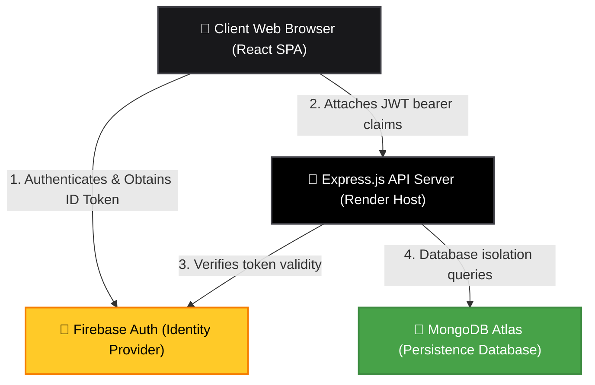

# TaskPilot — Architectural Overview & System Documentation

**TaskPilot** is a production-ready, full-stack SaaS task management portal engineered to deliver a seamless, high-performance, and secure experience for workspace management. Drawing visual inspiration from modern SaaS products like **Vercel**, **Linear**, and **Notion**, TaskPilot integrates a black-and-white monochromatic aesthetic with a robust multi-layer tech stack.

---

## 🏗️ Core Architecture Model

TaskPilot operates on a decoupled **Hybrid SaaS Architecture** that separates client identity management from database persistence and API service layers.

### Decoupled Identity vs. Persistence
*   **Firebase Authentication** serves strictly as the identity provider (IdP). It manages user registration, email/password storage, Google OAuth popup flows, email verification, and password resets.
*   **MongoDB Atlas** serves as the system's database. By decoupling database persistence from Firebase, TaskPilot avoids Vendor Lock-In, eliminates Firestore's offline connection bottlenecks, and maintains full control over complex schema validations and relationship models.

---

## 🎨 Technology Stack & Specifications

### 📱 Frontend Client
*   **Core Library**: **React v19.0 (Single Page Application)**
*   **Build Tool & Dev Server**: **Vite v8.0**
*   **Styling & Design System**: **Tailwind CSS v4.0** (utilizing `@custom-variant` class-based dark mode configurations)
*   **Icons Library**: **Lucide React** (clean, monochromatic custom priority indicators and navigation icons)
*   **Animation Library**: **Framer Motion v12.0** (powering spring physics transitions, collapsible sidebars, and tab overlays)
*   **HTTP Client**: **Axios v1.18** (implemented with request interceptors to automatically append Firebase JWT Bearer tokens)
*   **Client State**: **React Context API** (`AuthContext` for credentials lifecycle, `ToastContext` for status updates)
*   **Rendering Utilities**: **React Portals** (`createPortal` for boundary-free modal selector overlays)
*   **Static Asset Hosting**: **Firebase Hosting**

### 🚀 Backend API Server
*   **Runtime Environment**: **Node.js (v22 LTS)**
*   **Web Framework**: **Express.js v5.0** (lightweight RESTful router)
*   **Database ODM**: **Mongoose v9.7** (handling database connections, model validation, and schema definitions)
*   **Security & Auth Administration**: **Firebase Admin SDK v14.0** (verifying signature validity and claims of client JWT tokens)
*   **Cross-Origin Policy**: **CORS v2.8**
*   **Configuration Manager**: **Dotenv v17.4**
*   **API Hosting Host**: **Render Web Services**

### 🍃 Database Persistence
*   **Database Engine**: **MongoDB Atlas** (Cloud NoSQL Database)
*   **Connection Resilience**: Automated connection lifecycle hooks with 5-second automatic reconnect timeouts
*   **Data Indexing**: Unique compounding indices configured on `uid` and `email` properties for query speed and integrity

---

## 💻 Deep-Dive Backend Architecture

The backend is built on **Node.js** and **Express.js**, enforcing clean routing, resilient database connections, and standard HTTP middleware patterns.

### Resilient Mongoose Connection Policy
The database connector is configured to handle network drops and start up gracefully. Mongoose listeners monitor connection states and log detailed statuses:
*   `disconnected`: Emitted when connection drops.
*   `reconnected`: Logged once connection re-establishes.
*   **5-Second Retry Hook**: If the initial startup connection to MongoDB fails, the system logs the error and schedules a automatic reconnect retry after 5 seconds, preventing server crash loops on startup.

### Token Verification Route Guard
TaskPilot blocks unauthorized access to the database using an authentication middleware:
1.  Intercepts incoming requests and parses the `Authorization` header for a `Bearer <token>` JSON Web Token (JWT).
2.  Utilizes the **Firebase Admin SDK** (`admin.auth().verifyIdToken()`) to decode token signatures and verify expirations.
3.  Attaches the validated Firebase User ID (`uid`) to the request context (`req.user`), establishing a secure route guard.

### Schemas, Constraints, and Indexing
Data integrity is maintained using Mongoose Schemas:
*   **`User` Schema**:
    *   Holds user attributes (`uid`, `name`, `email`, `photoURL`, `provider`, `lastLogin`).
    *   Enforces index-level constraints with `unique: true` on both `uid` and `email` properties to prevent duplicate profile synchronization.
*   **`Task` Schema**:
    *   Holds task fields (`uid`, `title`, `description`, `status`, `priority`, `dueDate`).
    *   Ensures task ownership by requiring a valid `uid` mapped directly from the verified Firebase token.
*   **Constraint Mappings**: Express error-handling middleware catches Mongoose validation errors (such as `ValidationError` or `CastError`) and automatically decodes them into standard `400 Bad Request` HTTP responses.

---

## 🖥️ Deep-Dive Frontend Architecture

The client is a single-page application (SPA) built with **React**, **Vite**, **Tailwind CSS v4**, and **Framer Motion**.

### Axios ID Token Injection Interceptor
To authenticate requests, an Axios request interceptor is wired up inside `AuthContext.jsx`. Before *any* HTTP request is sent, the interceptor checks the active Firebase User session:
*   If the user is logged in, it retrieves a fresh ID Token (`getIdToken()`), automatically refreshing expired tokens in the background.
*   It appends the token to the outgoing request's headers as `Authorization: Bearer <ID_TOKEN>`.
*   If the connection fails on startup, the client handles the exception gracefully, rendering an **ErrorState** screen with a manual retry control.

### Monochromatic Aesthetics & Responsive Sidebar
TaskPilot implements a black-and-white monochromatic SaaS user interface:
*   **CSS Design System**: Custom HSL tokens define UI surfaces, zinc borders (`border-zinc-200/90` and `border-zinc-900`), and inputs.
*   **Sidebar Navigation**: Behave similarly to modern apps like ChatGPT:
    *   *Expanded*: Shows logo next to the `TaskPilot` label on the left, with the Menu button `☰` aligned to the right.
    *   *Collapsed*: Sidebar collapses to `70px`, hiding text labels and showing only icons with responsive tooltips. The logo centers itself and acts as the click target to expand the sidebar.
    *   *Mobile Viewports*: Sidebar is hidden by default and acts as an overlay drawer controlled by a responsive toggle button.
    *   *Persistence*: Sidebar state is saved in `localStorage`, maintaining preferences across refreshes.

### Custom Portal-Rendered Components
To prevent modal boundaries from cropping dropdowns and calendar components, TaskPilot uses **React Portals** via `createPortal`:
1.  **Smart Positioning**: Bypasses parent modal wrappers and mounts components directly to `document.body`.
2.  **Boundary Calculations**: Bounding rectangles calculate viewport height and screen limits.
    *   If space is available below the input, the component opens downward.
    *   If screen boundaries are exceeded below, it shifts and opens **upward** automatically.
3.  **Keyboard Listeners**: Arrow keys move focus highlight, `Enter` selects active items, and `Escape` closes the popover.

### Deterministic User Initials Avatars
To replace heavy image uploads and remove the Firebase Storage footprint, TaskPilot implements a deterministic avatar system:
*   **Initials Generator**: Supports multi-word names (e.g. `"Ajay Alpha" → "AA"`, `"Ajay" → "A"`).
*   **Deterministic Color Hashing**: The user's name is hashed mathematically to map to a consistent color from a curated palette of 10 modern colors. The user's avatar color remains identical across page refreshes and sessions without storing any custom data.

---

## 🔐 Security & Data Isolation

TaskPilot enforces strict isolation of tenant records:
*   **Enforced Queries**: Every backend database query filters records by the authenticated user's `uid` parsed from the Firebase ID token. Users cannot fetch, modify, or delete tasks belonging to other accounts.
*   **Input Validation**: String fields are sanitized, character limits are validated client-side with visual counters, and server-side model validations prevent database injection.
*   **No Committed Secrets**: System keys are loaded using environment variables (`.env` files), with template placeholders defined in `.env.example` configurations.

---

## 🚀 Performance & Bundle Optimization

*   **Vite Lazy Loading**: Major routes (`Dashboard` and `ProfileSettings`) are lazy-loaded via `React.lazy` and wrapped in `React.Suspense` skeleton boundaries, reducing initial bundle sizes.
*   **Zero Dependencies Footprint**: Unused libraries (like `react-icons` and `sweetalert2`) were removed, and obsolete components (like `Navbar.jsx`, `TaskForm.jsx`, and `LogoutModal.jsx`) were deleted. The production build size compiles cleanly in **1.79s**, saving critical network bandwidth.

---

## 🔄 End-to-End User Flow

1.  **Onboarding**: The user signs up using their email and password or Google OAuth.
2.  **Backend Sync**: On login, the backend `/users/sync` endpoint automatically syncs Firebase claims to MongoDB, updating metadata and fallback fields.
3.  **Workspace Loading**: The app checks backend health, loads the user session from cache (`localStorage`), fetches tasks isolated by `uid`, and resolves the UI skeleton loaders in milliseconds.
4.  **Task Operations**: The user can create, update, search, sort, and complete tasks with real-time analytics updates.
5.  **Secure Settings**: The profile settings page allows updating workspace names, changing account emails (requiring password verification), and dispatching password reset links.
6.  **Logout**: Clearing token caches returns the user to the auth screen.
